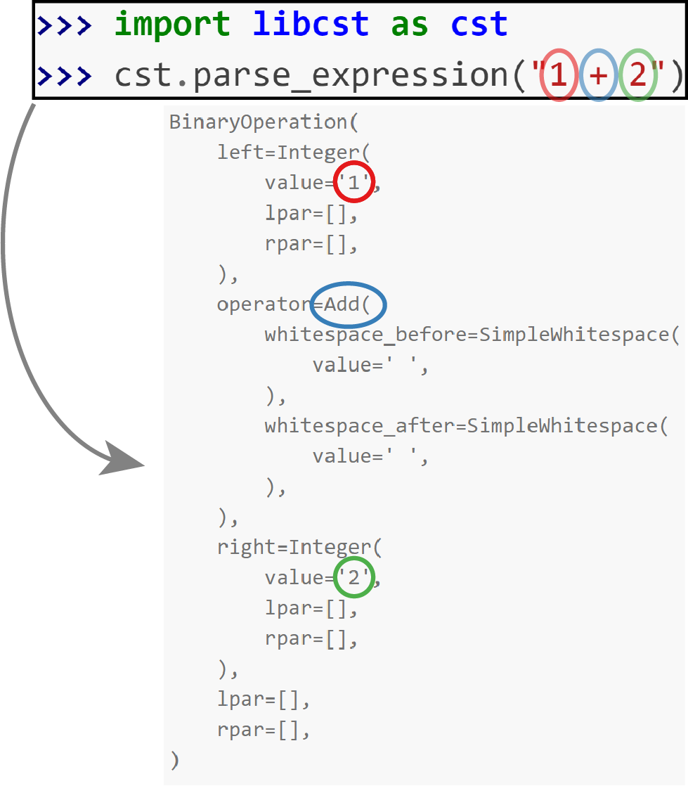

# libcst_examples
Some simple examples of code processing with libcst



## Install libcst

```
pip install libcst
```

## Examples

* **get_funcnames.py** creates a summary of functions and classes defined in a given file.
* **remove_comments.py** removes all comments that start with a single # and keeps the ones that start with ## (one # gets removed).
* **remove_logging.py** removes add logging calls that have priority either *info* or *debug*.
